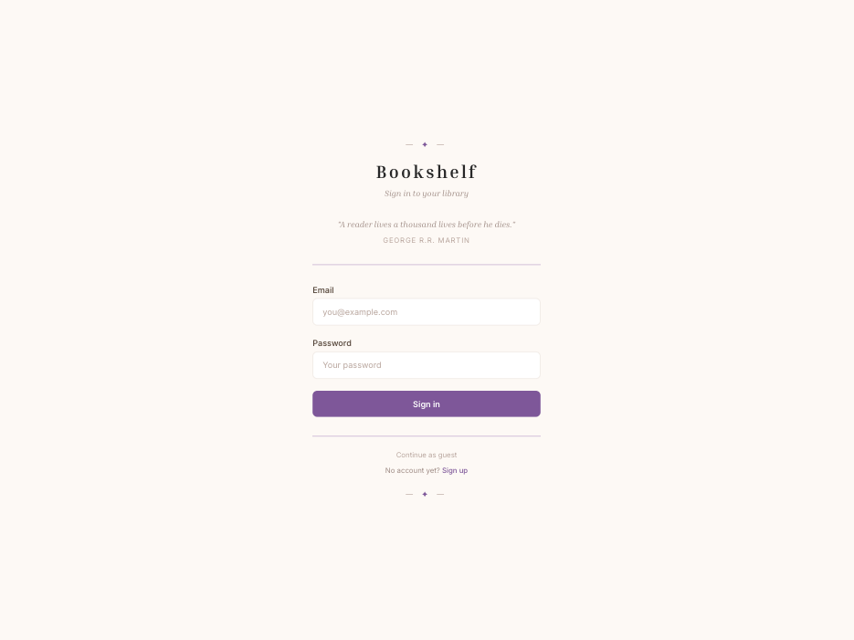
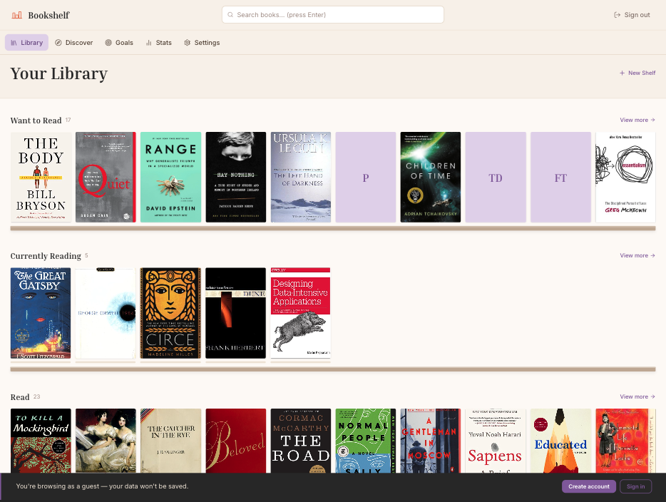
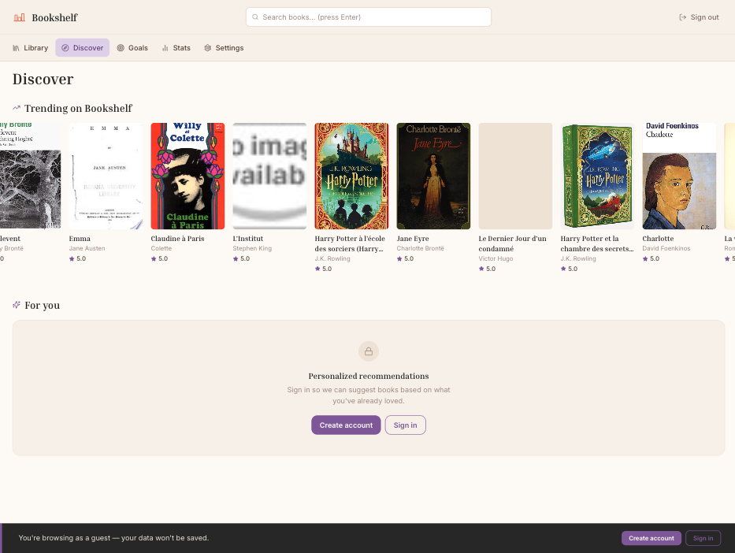
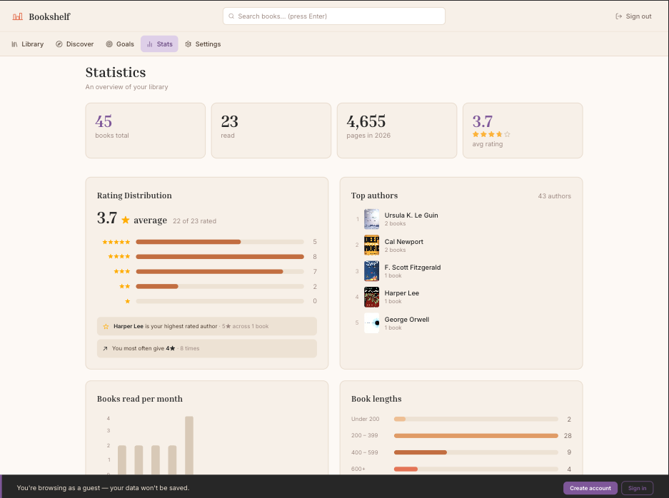
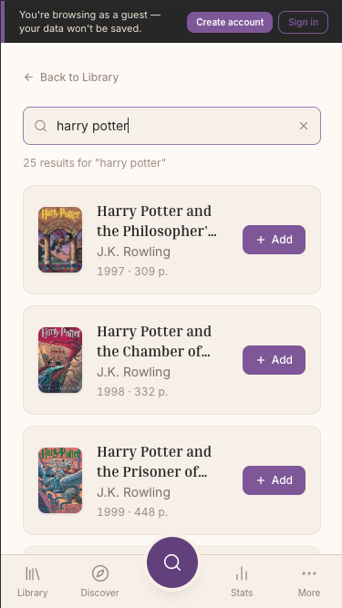
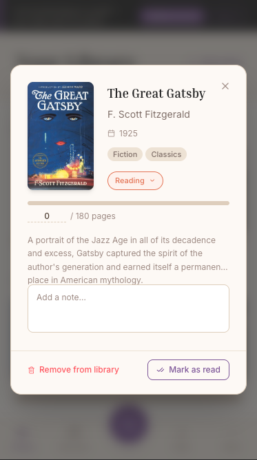

# Bookshelf — Personal Reading Tracker

A full-stack personal reading tracker that lets you search for books, organize them into shelves, track your reading progress, set annual goals, and explore reading statistics.

## Table of contents

- [Overview](#overview)
- [Demo & Screenshots](#-demo--screenshots)
- [Tech Stack](#️-tech-stack)
- [Features](#-features)
- [Links](#-links)
- [What I Learned](#-what-i-learned)
- [Author](#-author)

---

## Overview

### The challenge

Build a full-stack reading tracker with authentication, book search via external API, customizable shelves, reading progress tracking, annual goals, and year-in-review statistics.

The frontend was built using **Claude Code** as an AI coding assistant — handling component generation, refactoring and UI iteration while I focused on architecture decisions, SQL schema design and backend integration.

---

## 🎬 Demo & Screenshots

**Desktop Views**

  
  

  
  

**Mobile Version**

  
  

---

## 🛠️ Tech Stack

**Frontend:**

- React + TypeScript + Vite
- Tailwind CSS
- React Query (TanStack Query)
- React Router
- Framer Motion
- Recharts

**Backend:**

- Supabase (PostgreSQL + Auth + Edge Functions)
- PostgreSQL with Row Level Security (RLS)
- Supabase Edge Functions (Deno)

**External APIs:**

- Hardcover API (GraphQL) — book search & covers
- Anthropic Claude API — personalized book recommendations

**Tools:**

- Claude Code
- Git / GitHub
- Vercel (deployment)

---

## ✨ Features

- 🔐 **Authentication** — Sign up, sign in, guest mode with preloaded books
- 📚 **Book Search** — Search by title, author or ISBN via Hardcover API
- 🗂️ **Shelves** — Organize books into Want to Read, Currently Reading, Read + custom shelves
- 📖 **Reading Progress** — Track pages read with visual progress bar
- ⭐ **Ratings & Notes** — Rate books (1-5 stars) and add personal notes
- 🎯 **Annual Goals** — Set a reading goal and track your pace throughout the year
- 📊 **Statistics** — Genre breakdown, top authors, monthly reading chart, rating distribution
- 🔍 **Discover** — Explore trending books rated by other users
- 🤖 **AI Recommendations** — Claude-powered personalized book suggestions based on your reading history
- 📥 **CSV Import** — Import your library from Goodreads
- 📱 **Fully Responsive** — Optimized for mobile and desktop
- 🎨 **Appearance Settings** — Custom accent colors, fonts and themes

---

## 🔗 Links

- 🌐 **Live Demo:** [View Application](https://bookshelf-melaniecrzx.vercel.app/)
- 💻 **Source Code:** [GitHub Repository](https://github.com/Melaniecrzx/Bookshelf.git)

---

## 💡 What I Learned

### PostgreSQL & Supabase

- Designing a relational schema from scratch (books, shelves, user_books, reading_progress, goals)
- Writing SQL queries manually: SELECT, INSERT, UPDATE, DELETE, JOIN, GROUP BY, aggregations
- Implementing **Row Level Security (RLS)** — users can only access their own data
- Writing **PostgreSQL triggers** — automatically creating default shelves for new users
- Managing database migrations and constraints (UNIQUE, FOREIGN KEY, ON DELETE CASCADE)

### Claude Code

- Calling the **Anthropic Claude API** to generate personalized book recommendations
- Using Claude Code as an AI coding assistant to accelerate frontend development
- Writing effective prompts for component generation and UI iteration
- Managing context with CLAUDE.md for consistent code style across sessions

---

## 👤 Author

- GitHub — [@Melaniecrzx](https://github.com/Melaniecrzx)
- Portfolio — https://portfolio-melaniecrzx.vercel.app
